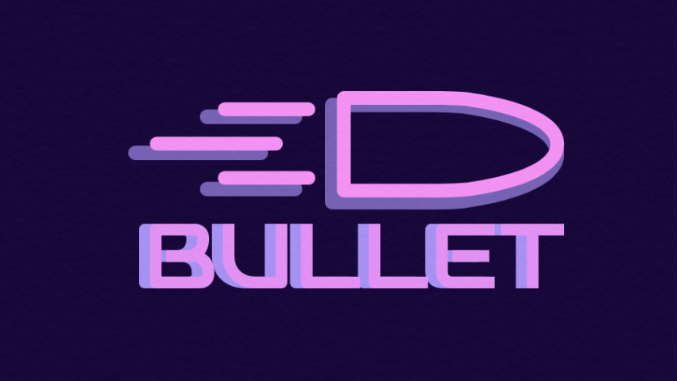

	 
	
	 

## What is Bullet Network?

In the most abstract form, Bullet Network is a layer 2 network built on top of Polygon used for fast and cheap payments. That means it inherits all of Polygon's security and decentralization, while still being performant and scalable. Furthermore, we chose to make Bullet Network an optimistic rollup, which is a battle-tested and powerful technology for scaling up.

## Our vision

We are developing Bullet Network as the decentralized optimistic rollup that makes good use of the top-notch technology of Polygon to leverage the scalability and decentralization of its ecosystem.

## How does our vision stand out from other rollups?

Our aim is to develop "decentralized sequencers" while many rollup projects only have centralized sequencers and costly approaches to prevent censorship such as manually force-exiting or transacting directly through layer 1, which even makes the gas fee higher than the layer 1’s fee and lose the purpose of having rollup in the first place. Our Decentralized sequencers will truly bring scalability and cheap transactions fee while being censorship resistant.

We are fixing the current existing problem with upgradability which most rollups currently face through Bullet. Many rollup projects currently face a problem with upgradability when developers can directly update the rollup; thus they can manipulate user's funds and the rollup functionality. We plan to make a governance system for updates of Bullet Network, which respects the rights and benefits of users. We can bring users true fairness through Bullet Network- a trustlest rollup while other projects may bring them uncertain and insecure!

## Special technology of the Bullet Network - an Optimistic rollup

As a layer 2 network, Bullet Network functions by moving state data off-chain, but still keeps some data on-chain to inherit security from the layer 1 and keep generality, something that only rollups like Bullet Network can achieve in comparison to state channels and plasma chains.

Transactions in Bullet Network are highly compressed, weighing around 84 bytes per transaction. Periodically, they are packed into a batch, which is then stored on-chain along with a root from those transactions and a state root generated from the new state. Users will then transit state based on the transactions stored on-chain. To highly optimize the process, the batch is stored in calldata, which is much cheaper than storing in storage.

To prevent faulty batches from being submitted, Bullet Network utilizes a fraud proof system. Basically, when a bad batch is sent to the layer 1, special participants of the network called validators will then submit a fraud proof to revert the fraudulent state, punish the submitter and get some rewards for himself. A fraud proof would contain the old state of which authenticity is achieved by checking against the previous state root, then the contract would perform a state-replay and get the root of the new state. If the state root generated is not equal to the state root that was submitted before, then the batch is fraudulent.

But there would also be a limit for how batches can be submitted, if anyone can submit a batch, then the state will break casually, thus, we need another kind of participant to submit a batch which is called "sequencer". A sequencer will be the one to take the transactions and pack it in a batch which is later submitted on the L1.

## How efficient is Bullet Network?

Being an optimistic rollup, a Bullet Network's transaction only costs about 3000 gas, while a normal transaction would cost 21000, so that is a seven-time improvement in gas efficiency.

## Impacts on the Polygon ecosystem

Because Bullet Network is an optimistic rollup built on top of Polygon, it helps bring scalable and cheaper transactions for Polygon while still maintaining its security and decentralization.
Bullet helps the blockchain industry scale along with other Polygon layers 2 networks like Nightfall, Miden, Zero, etc.
In the future, hopefully, we can integrate a contract runtime environment into Bullet to bring truly decentralized, secure, scalable dapps.
